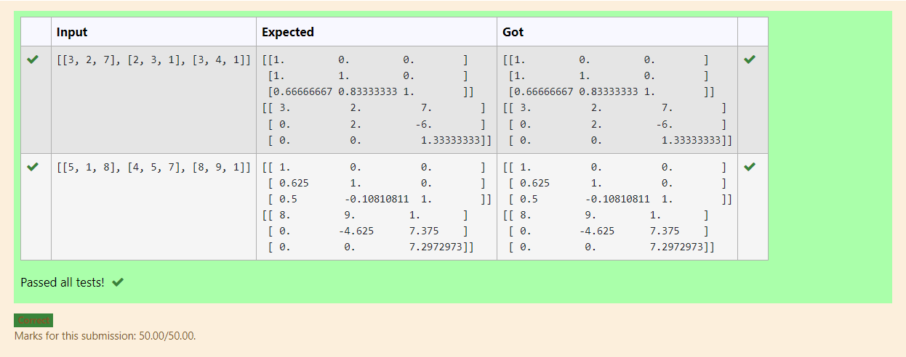

# LU Decomposition without zero on the diagonal

## AIM:
To write a program to find the LU Decomposition of a matrix.

## Equipments Required:
1. Hardware – PCs
2. Anaconda – Python 3.7 Installation / Moodle-Code Runner

## Algorithm
## Step 1:
Import the numpy module to use the built-in functions for calculation.

## Step 2:
From scipy.linalg module import the lu function

## Step 3:
Get inputs from the user and assign the values in np.array().

## Step 4:
Using the lu() function, we can find the L and U matrix.

## Step 5:
Print the obtained values.

## Step 6:
End the program. 

## Program:
```
Program to find L and U matrix using LU decomposition.
Developed by: Akash A
RegisterNumber: 21500127


# To print L and U matrix
import numpy as np
import scipy
from scipy.linalg import lu
A= eval(input())
P,L,U=lu(A)
print(L)
print(U)

```

## Output:



## Result:
Thus the program to find the LU Decomposition of a matrix is written and verified using python programming.

# Solving a Matrix using LU Decomposition.

## AIM:
To write a program to solve a matrix using LU Decomposition.

## Equipments Required:
1. Hardware – PCs.
2. Anaconda – Python 3.7 Installation / Moodle-Code Runner.

## Algorithm:
## Step 1:
Import the numpy module to use the built-in functions for calculation.

## Step 2:
From scipy.linalg module import lu_factor and lu_solve functions for calculations.

## Step 3:
Get inputs from the user and assign the values in A and B in np.array().

## Step 4:
Using the lu_factor(), we can find the LU and pivot.

## Step 5:
Call the lu_solve function by passing lu and pivot as first argument and B as second argument.

## Step 6:
Print the variable.

## Step 7:
End the program.

## Program:
```
Program to solve a matrix using LU decomposition.
Developed by: Akash A
RegisterNumber: 21500127


# To print X matrix (solution to the equations)
import numpy as np
import scipy 
from scipy.linalg import lu_factor,lu_solve
A= eval(input())
b= eval(input())
lu, piv= lu_factor(A)
x= lu_solve((lu,piv),b)
print(x)
```

## Output:


## Result:
Thus the program to find the LU Decomposition of a matrix is written and verified using python programming.

